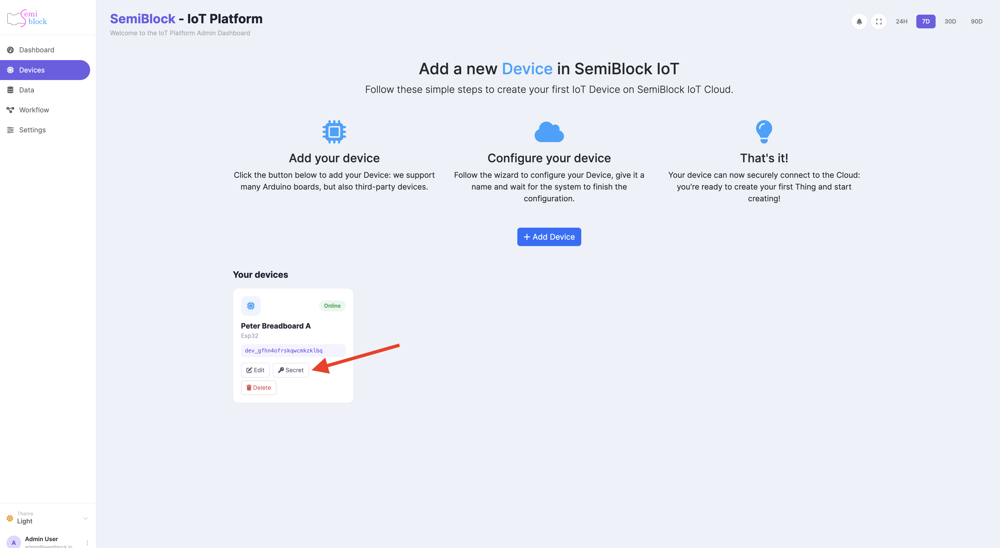
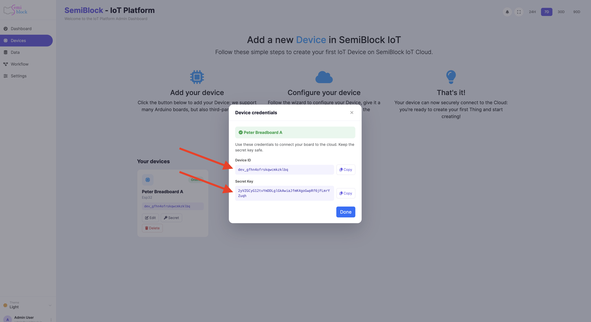

# Device ID & Secret Key

Every registered device is given two values that together act as its identity and password for the ingest API.

{width=100%}

{width=100%}

## Device ID (`device_id`)

- Public, non-secret identifier.
- Format: `dev_` followed by a random string (example: `dev_a1b2c3d4e5f6...`).
- Appears in the UI, in URLs, in exported data, and in the `device_public_id` column of the Data Explorer.
- Safe to log, print on an OLED, commit to a private repo, or put on a label on the physical device.
- Used by the server to look up which row in `iot_devices` the request claims to be.

## Secret Key (`secret_key`)

- **Never shown again after creation** (except via an explicit reveal action).
- 48+ character random value.
- Must be sent with every call to `/iot/data` or `/iot/commands/poll`.
- Treated as a bearer token — possession + the matching device_id is sufficient to act as that device.
- Stored hashed in the database using constant-time comparison on lookup.

## Where the UI shows them

- Immediately after you click **Create** on the Add Device form (modal with big copy buttons).
- Later, on the Devices list, each row has a key icon that opens a small dialog revealing the current secret (so you can re-flash a board without deleting the device).

## Rotation & revocation

- **Regenerate secret** (available on the device edit screen) — instantly invalidates the old secret; all prior readings stay.
- **Delete device** — removes the identity entirely. Historical readings are kept (they are useful for the Data Explorer and any connected Sheets) but no new data can arrive for that id.
- There is no "expiry" on secrets today; treat them like long-lived passwords.

## Comparison to other credential types

| Type            | Scope          | Who can use it                  | Revocable? |
|-----------------|----------------|---------------------------------|------------|
| User session    | Whole account  | Logged-in browser / API client  | Yes (logout) |
| Device secret   | One device     | Firmware / script that has it   | Yes (rotate or delete device) |
| Google service account (for Sheets) | One spreadsheet (after sharing) | The platform's background worker | Yes (remove share or disconnect in UI) |

## Embedding in firmware

Because the secret must live in the binary or a text file that travels with the code, the strong recommendation is:

- Put it in a file that is **never committed** (e.g. `secrets.py`, `config.h` that is `.gitignore`d).
- Document in the project README exactly how a student obtains their own credentials and creates the local file.
- For classroom hardware that is re-used, the teacher keeps the secret in a password manager and only distributes it to the current responsible student.

See [Keeping secrets safe](../security/secrets.md) for more operational advice.