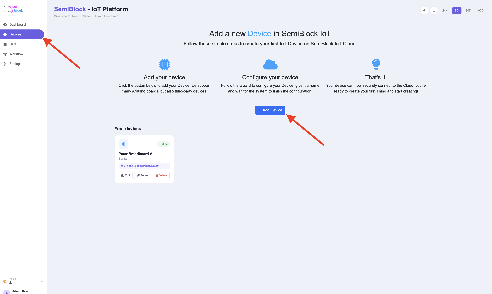

# Your First Device

This page is the hub for the very first steps after you decide to use the IoT platform.

## Prerequisites

- A SemiBlock account (the same one you use for the visual editors).
- A physical board or a desire to simulate one in the browser.

## Steps

{width=100%}

1. [Access the IoT console](access.md).
2. [Register a new device](add-device.md) — give it a memorable name and pick the closest hardware type.
3. Copy the generated **Device ID** (`dev_...`) and **Secret Key**. These two strings are what your code will send on every request.
4. [Understand the credentials](credentials.md) (what they are, how they differ from a user password, rotation, etc.).
5. Send your first reading:
   - Preferred: [from the visual editor using blocks](using-blocks.md)
   - Alternative: [direct HTTP from any firmware or script](http-api.md)
6. Verify in the web UI:
   - The device row now shows **online** and a recent `last_seen_at`.
   - A row appears in the **Data** table.
   - You can create a **Dashboard** widget that plots the value(s) you sent.

## What next?

- [Push more interesting data and build a dashboard](first-reading.md)
- [Connect the device to a Google Sheet](../integrations/google-sheets.md)
- [Create a workflow that reacts to the data](../workflows/index.md)
- [Learn the full ingest wire format](../data/ingest-api.md)

If anything goes wrong at this stage, the two most common causes are credential typos and pointing the device at the wrong server host — see the [credentials troubleshooting](../troubleshooting/credentials.md) page.