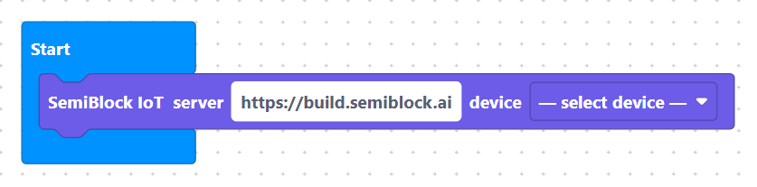
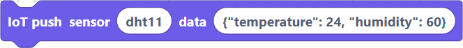
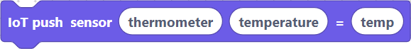

# Using the IoT Blocks from the Visual Editor

This page gives the practical "click here, drag that" instructions. For the generated code and wire format see the sibling pages.

## Prerequisites

- You have already created a Device in the IoT console and copied its **Device ID** and **Secret Key**.
- You are working in an editor that has the IoT category (currently the MicroPython editor has the richest support).

## Step-by-step in the MicroPython editor

1. Open or create a project.
2. From the **IoT** (or **Cloud**) toolbox category, drag an `iotConnect` block onto the workspace.

> {width=inherit}

3. Fill the three fields:
   - Server: the base URL of your SemiBlock deployment (the same origin that serves `/iot`).
   - Device ID: paste the `dev_...` value exactly.
   - Secret: paste the long random secret exactly.
4. (Optional but tidy) Put the `iotConnect` block inside `on start` or at the very top level so the constants are defined before any push.

> {width=inherit}

5. Read your sensor as usual (DHT, ADC, etc.).
6. Drag either:
   - `iotPushReading` — give it a sensor type string (e.g. `"dht11"`) and pass it the whole reading object or a constructed dict.

> {width=inherit}

   - `iotPushValue` — give it a sensor type, a key name, and a single numeric value or expression.

> {width=inherit}

7. Connect the push block after the sensor read, inside the main loop or a timer callback.
8. Click **Upload & Run** (or **Simulate**).

## What you should see

- In the **simulator** a cloud pane or log will show the push and the server response.
- In the real **IoT console** (separate browser tab) the device status flips to "online", `last_seen_at` updates, and a new row appears in the Data table.
- You can now add a Dashboard widget that plots the value(s) you just sent.

## Common mistakes

- Forgetting to place `iotConnect` before the first push (the globals will be undefined).
- Using the human-friendly device *name* instead of the generated `device_id`.
- Putting the secret in a public GitHub gist or screenshot.
- Pointing `IOT_SERVER` at the wrong environment (local vs production).

## Cross-editor notes

Other editors (Java, blockly-jvm, etc.) will grow equivalent blocks that ultimately call the same `/iot/data` endpoint with the same three credential fields. The conceptual model is identical even if the block labels differ slightly.

For the exact MicroPython code the blocks emit today, see the generator in the server repository under `blockly-microPython/src/generators/micropythonSimulator.js` (and the production generator).